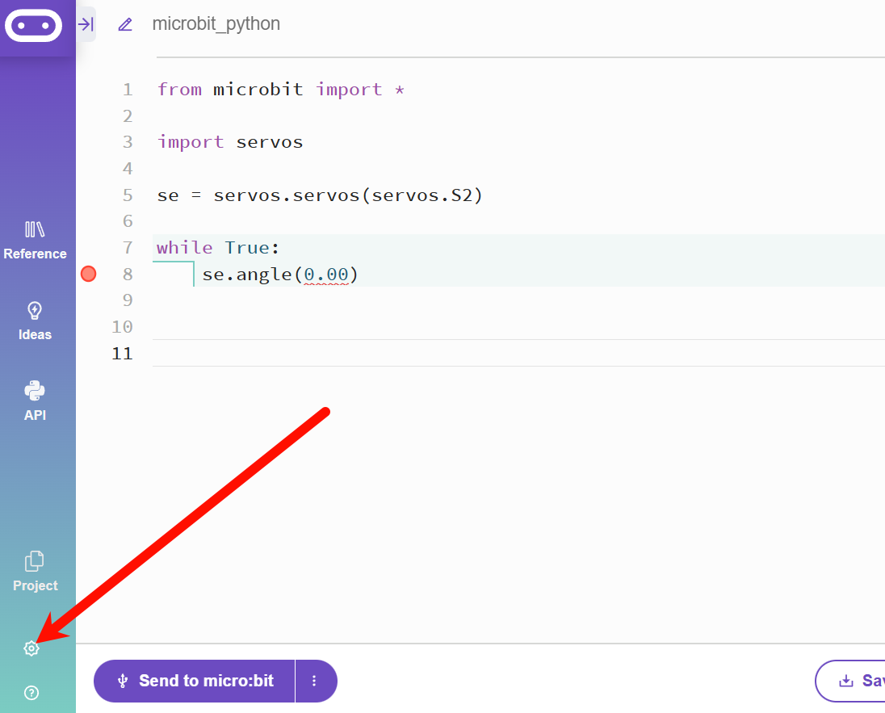
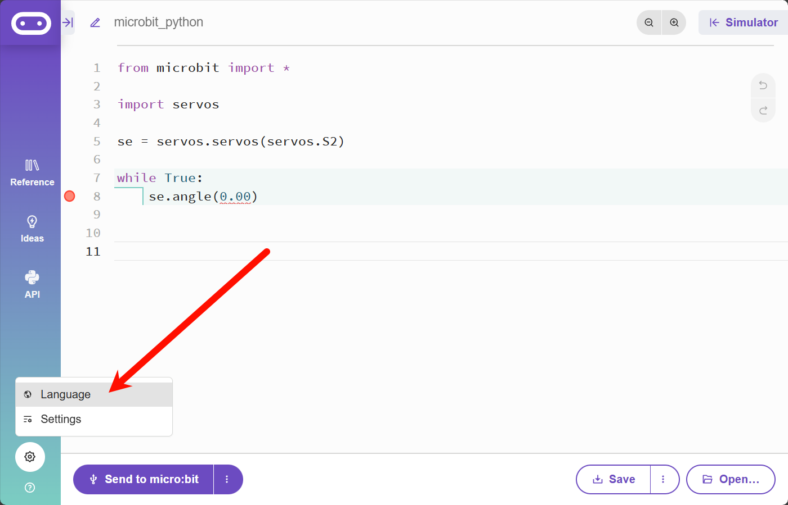
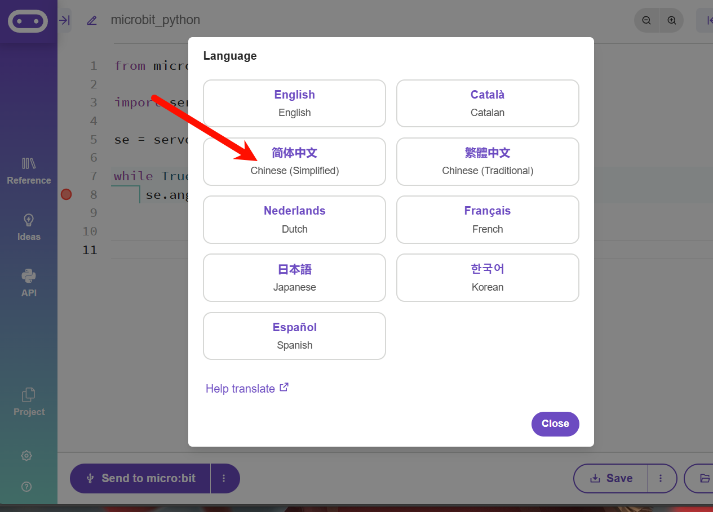
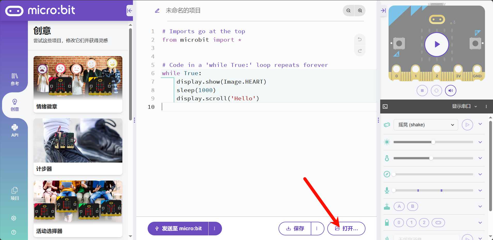
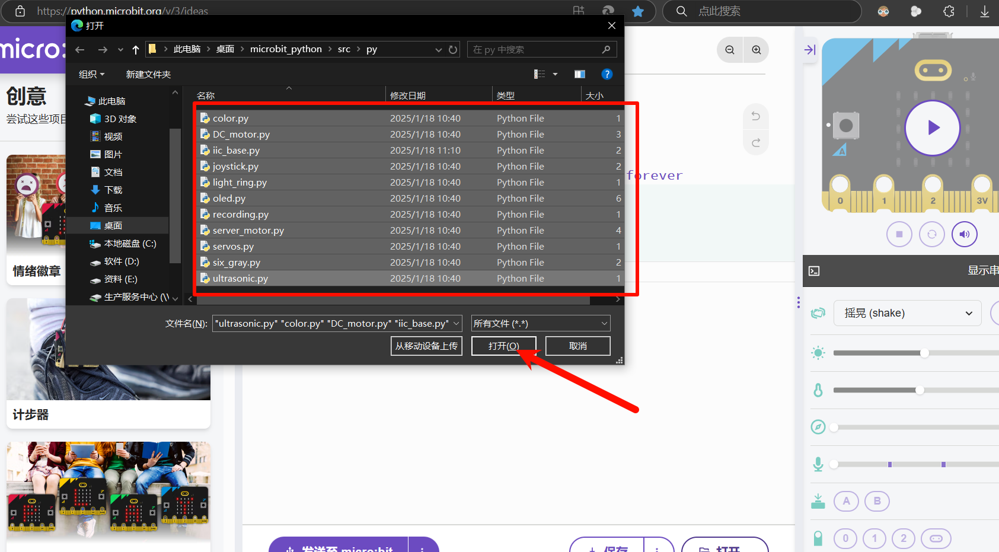
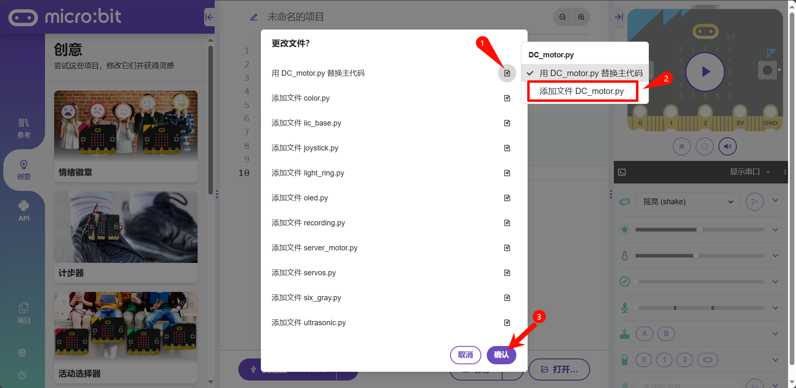
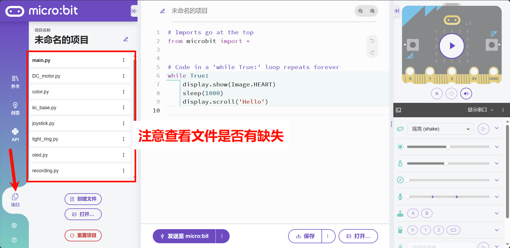

# micro:bit python库

***详细使用请查看[用户手册（docs/user_manual.pdf）](./docs/user_manual.md)***

## 导入库说明

- hex文件直接导入为一个导入库的空项目
- py为源文件 

[micro:bit Python Editor 网站](https://python.microbit.org/v/3/project)

### 切换为中文

### 导入示例项目

> 此方式是直接导入了一个新的项目，注意将原来编写的代码保存

### 按文件导入

<big>***特别注意***</big>

~~最好将库文件全部导入。除非明确知道单个文件的作用，否则不要只导入单个文件。<mark>文件间存在依赖关系</mark>。~~

`iic_base.py` 、`color.py` 、`DC_motor` 为必须导入的文件，其他请按需导入，否则可能会导致内存过大无法使用

